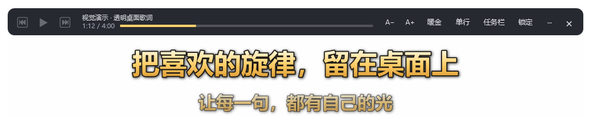

<p align="center">
  
</p>

# PhoneLyrics

把 iPhone 正在播放的媒体文字，显示为 Windows 透明桌面歌词或任务栏歌词。

PhoneLyrics 使用 [Apple Media Service（AMS）](https://developer.apple.com/library/archive/documentation/CoreBluetooth/Reference/AppleMediaService_Reference/Introduction/Introduction.html) 蓝牙接口接收手机媒体通知，并提供播放控制。手机负责播放声音，电脑负责显示歌词和发送控制指令。

**当前为实验版本。** 已在 Windows 11 x64、iOS 26、网易云音乐上验证。已有 AMS 连接可在手机链接退出后继续工作，但独立冷启动仍可能需要手机链接帮助建立连接；断线后需要手动重新连接。


*演示图使用原创示例文字，不连接手机。实际歌词取决于手机播放器推送的内容。*

## 功能

- **两种显示模式**：透明桌面浮窗与原生任务栏子窗口，可随时切换并复用同一条 AMS 连接。
- **桌面歌词**：暖金、青绿、白色配色，描边与阴影，拖动、字号、透明度、单行／双行设置。
- **任务栏歌词**：避让任务栏图标与托盘区域，可选择主屏或副屏；悬停显示播放控制和切回浮窗按钮。
- **手机控制**：播放／暂停、上一首／下一首；是否可用由当前媒体来源与 AMS 能力决定。
- **只读进度**：接收手机播放位置与时长，播放时在本地估算位置，暂停时冻结；没有有效数据时隐藏。
- **托盘与锁定**：单实例启动、鼠标穿透、全局快捷键、记住显示设置。
- **便携 EXE**：Windows x64 自包含单文件发布，内含 .NET 运行库。

### 歌词来自哪里？

AMS 没有独立的标准歌词字段。在本次网易云音乐测试中，开启「锁屏歌词」后，播放器会把当前歌词句子写入媒体 Title 字段，PhoneLyrics 转显这些文字。不开启或播放器不这样推送时，可能显示普通歌名。

双行模式显示「当前文字＋上一条收到的文字」，不是提前获取下一句歌词。当前没有联网歌词搜索、本地 LRC 导入、逐字卡拉 OK 或歌词时间轴匹配。

## 快速开始

需要一台带 BLE 蓝牙适配器的 Windows 电脑，以及已经与 Windows 配对的 iPhone。目前实际验证的组合为 Windows 11 x64＋iOS 26＋网易云音乐；其他系统、播放器和蓝牙适配器尚未验证。

1. 将便携版 `PhoneLyrics.exe` 放到自己的工具文件夹。维护者发布后可从本仓库 Releases 获取，也可按下方步骤自行构建；便携版无需预装 .NET。
2. 在手机上播放音乐；网易云音乐用户可开启锁屏歌词。
3. 双击 EXE。首次启动显示透明浮窗，悬停出现工具条。
4. 点击「任务栏」切换显示方式；任务栏悬停后的「↗」切回浮窗。
5. 如果提示未连接，打开「··· → 打开手机链接」，等待 iPhone 连接后选择「重新连接手机」。连接建立后可关闭手机链接窗口。

已有连接成功时，程序无需持续读取手机链接界面。手机离开蓝牙范围、睡眠或连接失效后，使用托盘的「重新连接手机」恢复。

### 多个已配对 BLE 设备

未指定设备时，仅在已配对 BLE 候选唯一时连接。多个设备时请退出已有实例，然后用 Windows 中的精确设备名称启动：

```powershell
.\PhoneLyrics.exe overlay --device-name "你的 iPhone 名称"
```

默认不会静默选择其他设备或电脑播放器。重复打开 EXE 会唤出已有实例，不会改变已绑定的设备。

## 常用操作



*示例模式中的播放按钮禁用，避免把视觉演示当作手机控制。*

| 操作 | 入口 |
| --- | --- |
| 移动浮窗 | 未锁定时拖动歌词或工具条的信息区域 |
| 字号与配色 | 工具条 A−／A＋、鼠标滚轮、配色菜单 |
| 单双行／透明度／宽度 | 工具条或歌词右键菜单 |
| 切换显示模式 | 浮窗工具条、任务栏「↗」、右键或托盘菜单 |
| 切换任务栏屏幕 | 任务栏歌词右键菜单 |
| 锁定／鼠标穿透 | 锁定按钮；Ctrl＋Alt＋L，冲突时尝试 Ctrl＋Alt＋Shift＋L |
| 解锁 | 实际快捷键显示在菜单中；也可用托盘「编辑歌词／解锁」 |
| 恢复浮窗 | 双击托盘；托盘可恢复位置和退出程序 |
| 查看设置与日志 | 托盘「打开设置与日志目录」 |

设置默认保存在 EXE 旁的 `overlay-settings.json`，日志保存在旁边的 `diagnostics/`。目录不可写时回退到 `%LOCALAPPDATA%\PhoneLyrics`，可从托盘查看实际目录。浮窗与任务栏分别记住字号、单双行和布局；锁定状态不保存。

## 构建与发布

开发需要 Windows 和 [.NET 10 SDK](https://dotnet.microsoft.com/download/dotnet/10.0)。`global.json` 使用 10.0.200 或更新的 .NET 10 feature band。从项目根目录执行：

```powershell
dotnet build PhoneLyrics.slnx -c Release
dotnet run --project tests/PhoneLyrics.Tests -c Release --no-build

# 直接运行界面
dotnet run --project src/PhoneLyrics -c Release -- overlay

# 无需手机的视觉演示
dotnet run --project src/PhoneLyrics -c Release -- overlay --demo --mode floating
```

生成便携单文件 EXE：

```powershell
.\scripts\Publish-Portable.ps1
```

输出为 `artifacts/portable/PhoneLyrics.exe`。采用 .NET 官方的[自包含单文件部署](https://learn.microsoft.com/en-us/dotnet/core/deploying/single-file/overview)，包含原生库，未启用裁剪。EXE 约 78 MB，运行时可能在用户临时目录建立原生库缓存。

便携 profile 固定内置运行库版本为 10.0.12（[微软发布说明](https://github.com/dotnet/core/blob/main/release-notes/10.0/10.0.12/10.0.12.md)）。自包含版本需重新打包才能更新内置运行库；后续发布时请核对版本及 `licenses/` 中的原始许可。

将便携 EXE 与使用说明、第三方许可及 SHA-256 打成正式附件：

```powershell
.\scripts\Package-Release.ps1
```

输出到 `artifacts/release/`，包含 `PhoneLyrics-v0.1.0-win-x64.zip`、同名独立 EXE 和 `SHA256SUMS.txt`。ZIP 采用明确的文件清单，不携带个人设置或日志。发布说明草稿在 [v0.1.0](docs/releases/v0.1.0.md)，建议先标记为 Pre-release；脚本只生成本地文件，不上传或创建 GitHub Release。

重新发布到正在使用的目录前，请从托盘退出程序；也可指定不同输出目录：

```powershell
.\scripts\Publish-Portable.ps1 -OutputDirectory .\artifacts\new-build
```

图标源为 `scripts/New-AppIcon.ps1`，生成 16～256 像素 ICO 与 PNG。修改后重新生成并发布即可。

仓库包含 Windows GitHub Actions 构建流程，执行编译、逻辑检查和便携包生成，输出 Actions artifact。该流程不进行蓝牙设备测试，也不自动创建 Release。

需要整理一个不含构建产物和本机记录的源码压缩包时，在本地 Git 仓库执行 `scripts/Export-Source.ps1`，输出 `artifacts/PhoneLyrics-source.zip`；它不会上传到 GitHub。

## AMS 诊断

需要终端输出时，单独构建控制台版。这个版本依赖 .NET 10 Desktop Runtime，需保留整个发布目录：

```powershell
.\scripts\Publish-Diagnostics.ps1
.\artifacts\diagnostics\PhoneLyrics.exe help
.\artifacts\diagnostics\PhoneLyrics.exe ams-discover
.\artifacts\diagnostics\PhoneLyrics.exe ams-watch --seconds 30

# 有多个 BLE 设备时指定名称
.\artifacts\diagnostics\PhoneLyrics.exe ams-watch --device-name "你的 iPhone 名称" --seconds 30
```

这些命令不发送播放控制。`ams-watch` 订阅媒体通知，默认保存本地 `trace.jsonl`，Ctrl＋C 可以结束。

需要明确测试手机控制时才执行下列命令，播放器名称必须与实际 AMS 数据一致：

```powershell
.\artifacts\diagnostics\PhoneLyrics.exe ams-control play --expect-player "网易云音乐" --seconds 10
```

控制命令要求显式播放器名称，并检查连接与来源；已知能力列表中不支持的命令会被拒绝。能力列表缺失时仅允许明确触发的标准命令，日志标记能力未知。接口交付成功不等同于手机实际响应，需要在手机上观察。

## 工作方式

`Core/` 通过公开 WinRT BLE 接口访问 AMS。连接时订阅媒体通知，并一次性补读缺失的初值；长文本带截断标志时补读完整属性。之后没有定时 GATT 读取。

位置由手机锚点、播放倍率和本地单调时钟估算；界面每 250 毫秒刷新一次，不查询手机。歌词 Title 更新不会重置位置锚点；曲目元数据变化、无效位置或断线会使旧时间线失效。

`Desktop/` 管理显示设置和手机连接，`Taskbar/` 负责原生窗口挂靠与空位计算。任务栏布局使用事件触发的后台测量，只读取控件类型和几何范围，不读取通知、聊天或其他应用标题。

```text
src/PhoneLyrics/
  Core/              AMS 协议、连接、通知与控制
  Desktop/           透明歌词、界面入口与设置
  Taskbar/           任务栏挂靠、布局与交互
  Infrastructure/    参数、日志、图标、存储与单实例
  Diagnostics/       AMS 诊断命令
  Assets/            原创程序图标
tests/PhoneLyrics.Tests/  协议、时间线、参数及布局检查
scripts/                 图标生成、发布与 Release 附件打包
licenses/                便携版随附运行库原始条款
docs/                    实现与验证说明
```

## 验证范围与限制

| 状态 | 内容 |
| --- | --- |
| 已实际验证 | iOS 26／网易云音乐 AMS 通知；手机链接进程退出后的已有连接与播放控制；两次手机暂停位置整秒对照；透明浮窗；主屏 125%、副屏 150% 任务栏与切换；单文件启动、图标和单实例 |
| 已实现但未完整验证 | 上一首／下一首手机曲目对照、Explorer 重启、屏幕拔插、休眠恢复、只读目录存储回退；没有在无 .NET 的干净机器运行 |
| 未实现或未解决 | 独立冷启动、自动掉线重连、完整 LRC 同步、逐字高亮、精确音频延迟校准 |
| 已放弃 | 从电脑调整手机播放进度；进度条仅用于显示 |

协议与布局的 29 项检查使用合成数据，不会连接或控制手机。实际位置对照：手机 3:05 对应 AMS 185.197 秒；手机跳转后暂停在 1:43 对应 AMS 103.280 秒。这只验证了整秒显示一致，不代表毫秒级同步精度。

当前任务栏仅支持横向布局；空间不足时回退浮窗。Windows 10、Windows ARM64、其他 DPI 和长期运行没有兼容承诺。

更详细的实现说明见 [开发说明](docs/DEVELOPMENT.md)，事实性验证范围见 [验证记录](docs/VALIDATION.md)。

## 本地数据

程序没有云服务、联网歌词搜索或上传功能。日志可能包含设备名称、播放器、曲目文字和歌词，默认留在本机。提交 Issue 时请先移除设备名称、蓝牙标识和个人路径；详细的本机探索记录、设置、截图与日志不包含在源码仓库中。

## 参考项目与许可证

感谢 [SanketsuYoru/LyricBand](https://github.com/SanketsuYoru/LyricBand) 的 AMS 与任务栏思路，以及 [ChissaQAQ/TaskbarLyrics](https://github.com/ChissaQAQ/TaskbarLyrics/) 的任务栏挂靠、DPI 和空位处理思路。本项目保留自己的 AMS 后端，没有使用这些项目的歌词抓取或播放器插件。

源码和原创图标采用 [MIT License](LICENSE)，Copyright © 2026 **yosoro114514**。参考项目说明及相应 MIT 许可见 [THIRD_PARTY_NOTICES.md](THIRD_PARTY_NOTICES.md)，也嵌在 EXE 的「关于」窗口中。源码许可证不代表对手机播放器传来的歌词内容授予再分发许可。

参与开发见 [CONTRIBUTING.md](CONTRIBUTING.md)。
